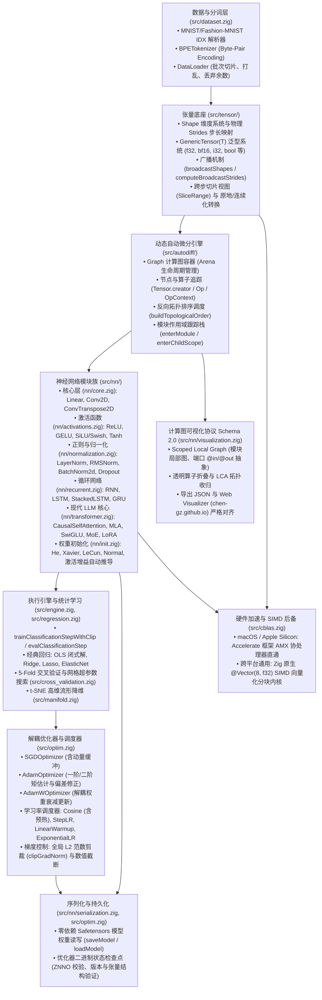
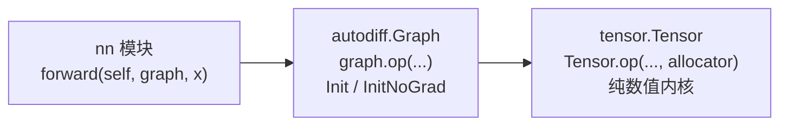

# ZNN 系统全景架构设计 (System Architecture Specification)

本文档详尽阐述 `znn` (Zig Neural Network) 深度学习与大语言模型框架的系统分层蓝图、核心数据结构、内存生命周期模型、动态自动微分机制、前沿网络算子设计以及计算图可视化体系。

---

## 1. 系统分层全景与数据流向 (System Overview & Architecture)

`znn` 采用高度解耦的分层架构设计，各子系统职责单一且边界清晰：

---

## 2. 张量底座系统 (Tensor Subsystem)

### 2.1 物理存储与逻辑形状 (Shape & Strides)
张量底层为一维连续浮点切片 `data: []f32`，多维空间映射由 `Shape` 与 `strides` 共同决定：
* **`Shape`**：记录张量的各维度尺度，如 `[batch_size, seq_len, num_heads, head_dim]`；
* **`strides`**：表示在特定轴推进一个元素时，底层一维索引需跳跃的物理偏移量；
* **行优先连续布局 (Row-Major Contiguous)**：
  $$
  \text{stride}[d] = \prod_{k=d+1}^{N-1} \text{shape}[k], \quad \text{stride}[N-1] = 1
  $$
* **多维寻址映射**：对多维坐标 $(i_0, i_1, \dots, i_{N-1})$，物理偏移为：
  $$
  \text{offset} = \sum_{d=0}^{N-1} i_d \times \text{strides}[d]
  $$

### 2.2 广播机制 (NumPy-Style Broadcasting)
当对两个形状不同的张量执行逐元素二元运算时（如 $A + B$），系统遵循标准 NumPy 广播语义：
1. **维度对齐**：从尾部轴向前逐一比对维度大小；若其中一个张量维度较少，则在高维方向隐式补 $1$；
2. **合法性检查**：对于对齐的轴 $d$，必须满足 $\text{dim}_A[d] == \text{dim}_B[d]$ 或其中之一为 $1$；
3. **步长变换 (`computeBroadcastStrides`)**：若张量在轴 $d$ 上的尺寸为 $1$，则将其在广播输出中的计算步长强制置 $0$（实现虚拟重复访问而不消耗额外内存）。

### 2.3 泛型张量与跨步切片 (Generic Tensor & Strided Slices)
* **`GenericTensor(T)`**：基于 Zig `comptime` 特性构建的多精度张量模板，统一支持 `f32`、`f64`、`bf16`（标准 Brain Floating Point 16-bit 格式）、`i32`、`i64`、`u8` 和 `bool`；
* **`SliceRange` 跨步切片**：提供带 `step` 步长的任意子区间索引能力，支持无拷贝切片视图与原地连续化重排 (`contiguous`)。

---

## 3. 动态自动微分引擎 (Dynamic Autodiff & Computation Graph)

### 3.1 磁带式前向记录与动态拓扑 (Tape Recording)
`znn` 采用动态反向模式自动微分 (Dynamic Reverse-Mode Automatic Differentiation)：
* **前向传播记录**：在运算发生时，动态创建输出 `Tensor`，将其 `creator` 指向生成该张量的 `Op` 结构体；
* **反向传播调度**：
  1. 调用 `graph.backward(loss)`，从目标标量张量开始执行深度优先搜索 (DFS)；
  2. 生成严格的逆拓扑排序序列 (`buildTopologicalOrder`)；
  3. 将损失张量的梯度初始化为 $1.0$ (`loss.grad[0] = 1.0`)；
  4. 逆序遍历节点，调用各算子预定义的 `backward` 钩子函数，将梯度链式回传并累加至输入张量的 `grad` 切片中。

### 3.2 批次级内存池架构 (Arena Allocator Lifecycle)
深度学习训练循环中频繁产生大量的临时激活张量、中间形状与梯度切片。若通过通用的操作系统堆分配器频繁申请和释放，极易导致高昂的系统调用开销与内存碎片。

`znn` 采取了明确的双轨制内存设计：
1. **持久权重 (Persistent Weights)**：模型参数（如 `Linear.weight`、`Conv2D.bias`）通过调用者传入的通用分配器（GPA）分配，生命周期跨越整个训练过程，在模块 `deinit` 时集中释放；
2. **批次临时张量 (Ephemeral Activations & Gradients)**：计算图内部内置 `std.heap.ArenaAllocator`。每次前向计算和反向传播中生成的所有中间张量、Op 节点及临时缓冲区均从 Arena 中分配。在批次迭代结束时（`graph.deinit()`），整块 Arena 内存被以 $O(1)$ 代价瞬间回收，彻底规避内存泄漏与指针悬挂。

### 3.3 模块作用域跟踪 (Module Scoping in Graph)
为了支持深层神经网络的层次化拓扑推导与可视化导出，`Graph` 维护了一个当前正在执行 forward 的作用域栈：
* **`graph.enterModule(name, module_type)`**：模块在 forward 开始前压栈，通过 `defer scope.exit()` 保证在退出作用域时自动弹栈；模块未命名时返回空守卫；
* **`graph.enterChildScope(local_name, module_type)`**：用于模块内部复杂子逻辑（如注意力机制内部的 "core" 运算）的命名空间隔离；
* 运算过程中创建的所有算子与激活张量均自动打上当前作用域标签 (`Op.scope` / `Tensor.scope`)。

### 3.4 分层依赖：Tensor ← Graph ← nn (Layered Dependencies)
三层之间是严格的单向调用关系：
* **`tensor` 层 (`src/tensor/`)**：纯数值张量库。所有 `Tensor` 方法与 `tensor.concat` / `tensor.split` 只接收 `allocator`，执行纯计算并返回新张量 (或零拷贝视图)，从不调用 `Graph`。`Tensor` 仅以数据字段 (`grad`、`requires_grad`、`creator: ?*Op`、`scope`) 承载自动微分元数据，供上层写入与读取。
* **`autodiff` 层 (`src/autodiff/`)**：`Graph` 的每个算子 (`graph.matmul`、`graph.add`、`graph.softmax` …) 先在自身 Arena 上调用对应的纯 `Tensor` 内核完成前向计算，再按 `enable_grad` 决定是否分配梯度缓冲区并记录 `Op` 节点。
  * `Graph.init(allocator)`：训练模式，记录反向传播所需的算子；
  * `Graph.initNoGrad(allocator)`：推理 / 评估模式，只执行前向计算，不分配梯度、不记录 `Op`，中间张量仍在 Arena 中随 `deinit` 一并释放；
  * `graph.arenaAllocator()`：获取计算图 Arena 分配器，用于与计算图同生命周期的临时缓冲区 (如 `RNN.forward` 返回的输出切片)。
* **`nn` 层 (`src/nn/`)**：所有模块的前向统一为 `forward(self, graph: *Graph, x, ...)`，只通过计算图执行算子，没有 Eager / Graph 双分支，也不需要手动释放中间张量。推理时调用方传入 `Graph.initNoGrad` 构建的计算图即可。
* **KV-Cache 单步推理** (`CausalSelfAttention.forwardInference` / `MLALayer.forwardInference`)：在函数内部创建局部无梯度计算图承载中间张量，最终输出拷贝到调用方分配器上返回。

---

## 4. 神经网络子系统架构 (Neural Network Modules Zoo)

### 4.1 模块解耦与编译期参数反射 (`collectParameters`)
神经网络模块设计遵循“**数据与逻辑分离、状态外置**”的标准：
* 模块内部仅持有自身的参数张量与超参数配置；
* 模块无需知晓优化器的存在；
* **编译期参数提取**：`nn.collectParameters(model, allocator)` 借助 Zig 的编译期类型反射 (`@typeInfo`)，自动递归遍历模型结构体中的所有字段：
  - 遇到 `*Tensor` 且 `requires_grad == true` 时将其压入参数列表；
  - 遇到子结构体时递归向下探查；
  - 杜绝了传统框架中手动维护 `self.parameters = [...]` 导致的漏注风险。

### 4.2 权重初始化与增益管理 (`nn/init.zig`)
根据网络激活函数的不同数学曲率，系统提供完备的方差缩放初始化策略：
* **`calculateGain(nonlinearity)`**：
  - ReLU / LeakyReLU: $\text{gain} = \sqrt{2.0}$
  - Tanh: $\text{gain} = 5.0 / 3.0$
  - Linear / Identity / Sigmoid: $\text{gain} = 1.0$
* **初始化方法集 (`InitMethod`)**：
  - **He (Kaiming) Normal / Uniform**：针对深层 ReLU / GELU 网络的方差平衡；
  - **Xavier (Glorot) Normal / Uniform**：针对 Sigmoid / Tanh 的对称双端收敛；
  - **LeCun Normal**：自归一化神经网络推荐；
  - **自定义初始化保护机制**：通过 `is_custom_initialized` 标志位，确保特定层（如 LoRA 旁路 B 初始全零、Embedding 自定义分布）在全局初始化时不会被意外覆盖。

### 4.3 现代大模型架构核心 (`nn/transformer.zig`)
1. **因果多头自注意力 (`CausalSelfAttention`)**：
   - 包含 $Q, K, V$ 投影矩阵与输出投影 $O$；
   - 内置因果下三角掩码，杜绝未来信息泄漏；
   - 支持动态 `KVCache` 键值缓存，自回归解码从 $O(N^2)$ 降低至 $O(N)$。
2. **多头潜在注意力 (`MLALayer` / DeepSeek MLA)**：
   - 引入低秩键值压缩机制（$d_c$ 潜变量投影）与解耦的旋转位置编码（RoPE $d_r$ 向量）；
   - 大幅缩减推理时 KV Cache 的显存占用。
3. **SwiGLU 门控前馈网络 (`SwiGLU`)**：
   - 采用双路投影结构：$\text{SwiGLU}(x) = (\text{SiLU}(x W_{\text{gate}}) \odot (x W_{\text{up}})) W_{\text{down}}$；
   - 相比传统两层 MLP 具备更优秀的表征容量与训练稳定性。
4. **混合专家网络 (`MoELayer`)**：
   - 基于门控路由网络（Router）对 Token 进行 Top-K 专家激活打分；
   - 支持动态稀疏激活计算与负载均衡惩罚项。
5. **参数高效微调 (`LoRALinear`)**：
   - 冻结预训练基础权重 $W_0$，挂载并联低秩可学习矩阵 $A \in \mathbb{R}^{d \times r}$ 与 $B \in \mathbb{R}^{r \times k}$；
   - 前向变换：$h = x W_0 + \frac{\alpha}{r} (x A) B$；
   - 矩阵 $B$ 初始置零，保证微调起点与原模型输出严格对齐。
6. **偏好对齐损失 (`DPO` / `GRPO`)**：
   - 直接偏好优化 (Direct Preference Optimization, DPO) 目标函数：无需显式训练奖励模型，直接通过胜出回答与落败回答的对数概率对策略进行优化；
   - 群体相对策略优化 (GRPO) 优势估计。

---

## 5. 解耦优化器与训练基础设施 (Optimizers & Engine)

### 5.1 优化器状态解耦与参数更新
优化器（`SGDOptimizer`, `AdamOptimizer`, `AdamWOptimizer`）作为独立主体运作：
* **状态隔离**：动量速度向量、一阶矩估计 $m$、二阶矩估计 $v$ 完全由优化器持有；
* **AdamW 解耦权重衰减**：
  $$
  m_t = \beta_1 m_{t-1} + (1 - \beta_1) g_t, \quad v_t = \beta_2 v_{t-1} + (1 - \beta_2) g_t^2
  $$
  $$
  \hat{m}_t = \frac{m_t}{1 - \beta_1^t}, \quad \hat{v}_t = \frac{v_t}{1 - \beta_2^t}
  $$
  $$
  \theta_t = \theta_{t-1} - \eta_t \left( \frac{\hat{m}_t}{\sqrt{\hat{v}_t} + \epsilon} + \lambda \theta_{t-1} \right)
  $$
  权重衰减 $\lambda \theta_{t-1}$ 直接施加在参数本身而非梯度上，避免自适应梯度步长对其造成扰动。

### 5.2 学习率调度器与梯度剪裁
* **`CosineScheduler`**：支持带线性预热阶段的余弦退火学习率更新；
* **`StepLRScheduler` / `LinearWarmupScheduler` / `ExponentialLRScheduler`**；
* **`clipGradNorm`**：计算所有模型参数梯度的全局 $L_2$ 范数 $\|\mathbf{g}\|_2 = \sqrt{\sum \|\mathbf{g}_i\|_2^2}$，若超出阈值则等比例收缩，彻底抑制梯度爆炸。

### 5.3 检查点持久化规范 (`ZNNO`)
优化器状态二进制序列化采用严谨的安全校验协议：
1. **Magic Header**：文件头固定为 4 字节魔数 `ZNNO`；
2. **Version Tag**：4 字节版本标识；
3. **Optimizer Tag**：枚举类型标识（SGD: 0, Adam: 1, AdamW: 2）；
4. **Dimension Verification**：反序列化时逐一比对参数总数与每个参数缓冲区的物理长度，杜绝加载损坏或结构不匹配的模型权重。

---

## 6. 软硬件协同加速 (Hardware Acceleration & SIMD)

### 6.1 macOS Accelerate & AMX 协处理器
在 macOS / iOS 平台上，`src/cblas.zig` 动态绑定系统级动态库中暴露的 `cblas_sgemm` C 语言符号。通过 Apple 深度优化的 Accelerate 框架，底层矩阵乘法直通 Apple Silicon 的 AMX (Apple Matrix Coprocessor) 矩阵硬件单元，以极低功耗实现单核数百 GFLOPS 的计算吞吐。

### 6.2 跨平台 SIMD 后备实现
在 Linux、Windows 以及 WebAssembly 平台下，系统启用纯 Zig 编写的向量化 GEMM 内核：
* 使用 Zig 原生 `@Vector(8, f32)` SIMD 指令；
* 每次循环并发处理 8 个单精度浮点数的乘加运算 (FMA)；
* 经过缓存块优化，消除跨平台依赖与动态库链接错误。

---

## 7. 计算图可视化与 Schema 2.0 协议 (Graph Visualization Pipeline)

`znn` 具备完善的计算图拓扑导出系统，输出符合 JSON Schema 2.0（draft 2020-12）标准的拓扑结构，与前端 Web 可视化工具（`chen-gz.github.io/visualizer`）保持严格的契约对齐。

### 7.1 局部图与端口化模型 (Scoped Local Graph & Ports)
* **局部图**：每个复合模块只导出自身的局部拓扑（直接子模块、自身算子、常量缓冲区与端口），完整规范见 [model-graph-visualization.md](model-graph-visualization.md)；
* **输入/输出端口化**：模块与外部环境的张量交互通过显式声明的 `@in<k>` 与 `@out<k>` 虚拟端口完成；
* **LCA 跨层收归法则**：跨越多个层级的深层依赖关系，通过最近公共祖先 (Lowest Common Ancestor) 路径解析，确保每层模块视图拓扑自闭合；
* **节点分类枚举 (`NodeKind`)**：严格将张量节点细分为四类：
  - `Param`：可训练模型参数（权重、偏置）；
  - `Input`：外部输入批次张量；
  - `Buffer`：非梯度常数或运行统计量（如 BatchNorm 均值方差）；
  - `Activation`：前向算子计算产生的中间激活状态。

---

## 8. 代码质量、测试与基准规范 (Testing & Benchmarks)

1. **测试全覆盖**：
   - 单元测试涵盖所有数学算子正向/反向梯度精度校验、极限广播边界、长文本自回归生成、多层 GPT 结构一致性；
   - 通过 `zig build test` 秒级验证。
2. **代码覆盖率追踪 (`kcov`)**：
   - 内置覆盖率测试流水线 (`zig build coverage`)，全库行覆盖率保持在 91%+ 以上。
3. **性能基准系统 (`src/bench.zig`)**：
   - 内置毫秒/纳秒级统计测试器，自动输出 GFLOPS 算力、内存吞吐带宽及各网络层耗时分布。

---

## 9. 核心架构演进与瓶颈诊断清单 (Architectural Bottlenecks & Roadmap)

以下关键瓶颈已列入技术演进追踪（详见 [`plan/TODO.md`](../plan/TODO.md)）：

### 9.1 跨平台 CPU Fallback 多核并行瓶颈 (对应问题 3)
* **现状定位**：
  在 macOS 平台，`znn` 借助 Accelerate 框架直接调用 Apple Silicon AMX 协处理器；但在 Linux 与 Windows 上，`src/cblas.zig` 的纯 Zig 后备实现采用单线程 `@Vector(8, f32)` SIMD 向量化，无法利用多核服务器的并发算力。
* **规划方案**：
  1. 引入轻量级线程池调度器（`std.Thread`），对 M 维与 N 维进行分块（Tiling & Blocking）多线程并发调度；
  2. 在 `build.zig` 中引入 `-Dblas=[accelerate|openblas|mkl|fallback]` 编译配置选项，支持在 Linux 端自动探测并链接系统 OpenBLAS 或 Intel MKL。

### 9.2 长序列自注意力 $O(S^2)$ 内存开销与 KV Cache 优化 (对应问题 4)
* **现状定位**：
  `src/nn/transformer.zig` 的 `CausalSelfAttention` 目前完整物化 $[B, H, S, S]$ 的全量注意力矩阵，长序列（Long Context）训练时内存开销呈平方级暴增；KV Cache 当前采用静态预分配连续缓冲区。
* **规划方案**：
  1. 研发 FlashAttention 原理的 Online Softmax 分块流式计算，将显存复杂度降至 $O(S)$ 并大幅提升 SRAM/L1 缓存局部性；
  2. 实现动态扩容与分页式 KV 缓存（Paged KV Cache），最大化自回归解码吞吐。

