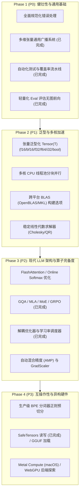

# 🗺️ ZNN 架构设计与工程规划目录 (Engineering Plans & Roadmap)

欢迎查阅 `znn` (Zig Neural Network) 的技术架构规划与工程演进文档库。本目录聚合了项目的架构诊断、功能缺口对比及分阶段研发路线图。

---

## 📂 规划文档索引 (Document Directory)

| 文档名称 | 核心主题 | 重点内容 |
| :--- | :--- | :--- |
| **[TODO.md](TODO.md)** | **全面现状诊断与分阶段任务清单** | • 6 个核心技术维度的现状诊断与不成熟之处 • Phase 1 (P0) 至 Phase 4 (P3) 细分开发任务 • 已交付里程碑与待完成特性的最新跟踪状态 |
| **[NUMPY_GAP_ANALYSIS.md](NUMPY_GAP_ANALYSIS.md)** | **现代 NumPy 2.x 深度对比与补齐规划** | • 科学计算底座 vs. 深度学习框架的定位差异 • 9 大能力维度的全景差距诊断表 • 泛型 Dtype、零拷贝切片、多轴归约、线性代数等具体演进方案 |

---

## 🧭 总体技术演进路线 (Architecture Evolution)

---

## 📌 当前交付重点与近期优先级

1. **短期交付成果 (Recently Completed)**:
   * **模块化重构**：将臃肿的 `nn.zig` 拆解为 `nn/core.zig`、`nn/normalization.zig`、`nn/transformer.zig`、`nn/recurrent.zig`、`nn/serialization.zig` 等领域子模块。
   * **训练控制**：解耦优化器架构（SGD, Adam, AdamW）、学习率调度器、全局 L2 梯度剪裁与二进制 Checkpoint 持久化。
   * **前沿模型算子**：GQA、DeepSeek 风格 MLA、MoELayer、RLHF/DPO Loss 与 GRPO 优势估计。
   * **测试覆盖率保障**：104+ 极限边界测试用例全量通过，建立基于 `kcov` 的端到端自动化覆盖率测试，代码覆盖率达 **91.71%**。

2. **下一阶段攻坚 (Immediate Next Steps)**:
   * **Tensor 泛型化**：实现 `Tensor(comptime T: type)`，优先打通 `f32`/`bf16` 混合精度基础与 `bool` 掩码。
   * **通用多轴 Reduction API**：提供可配置 `axis: ?usize` 与 `keepdims: bool` 的 `sum`, `mean`, `var`, `std`, `min`, `max`。
   * **多核多线程分块加速**：引入 Zig 原生轻量线程池调度器，加速大矩阵逐元素算子与卷积前向/反向计算。
