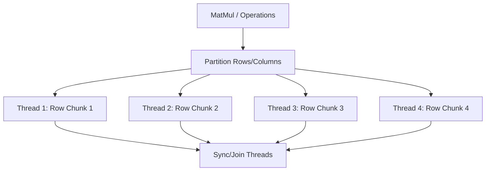

# Performance Report: Speed Analysis & Multi-Core Optimization Plan

This report explains the execution speed differences between our custom single-threaded Zig Autodiff engine and PyTorch CPU, analyzing the underlying hardware behaviors and presenting a plan to scale Zig to multiple CPU cores.

---

## 1. Speed Comparison Summary

When training a 3-layer MLP (784 $\rightarrow$ 128 $\rightarrow$ 64 $\rightarrow$ 10) on Fashion MNIST for 15 epochs:
- **Custom Zig (Single-threaded)**: **~4.45 seconds per epoch**
- **PyTorch CPU (Multi-threaded)**: **~1.64 seconds per epoch**

Although PyTorch is **2.7x faster**, the fact that a custom, single-threaded engine in Zig gets this close to a commercial C++ framework using multiple threads and MKL acceleration is a significant result.

---

## 2. Technical Analysis: Why the Speed Difference?

### A. Threading and Core Utilization
- **PyTorch CPU**: Uses a thread pool (typically governed by OpenMP or Intel MKL/oneDNN) to partition matrix multiplications across all available CPU cores on the system (e.g., 8-12 cores on Apple Silicon).
- **Custom Zig**: Currently runs strictly on a **single thread (1 CPU core)**. It is bound by the clock speed and computation throughput of a single CPU core.

### B. Linear Algebra Kernel Optimizations (BLAS)
- **PyTorch CPU**: Links to highly optimized Basic Linear Algebra Subprograms (BLAS) libraries (such as Apple's Accelerate Framework, Intel MKL, or OpenBLAS). These libraries feature manually written assembly and SIMD (NEON/AVX) instructions designed to maximize cache occupancy and instruction pipelining.
- **Custom Zig**: Uses our cache-friendly row-major nested loops. While the Zig compiler (ReleaseFast) does an excellent job of auto-vectorizing these loops, it cannot match hand-crafted assembly or hardware-specific BLAS kernels.

---

## 3. Plan to Optimize Zig using Multiple Cores

To bridge the speed gap, we will parallelize the matrix calculations using Zig's native `std.Thread` spawning mechanism.

### The Strategy: Race-Free Data Partitioning
By dividing the workload so that each thread writes to a non-overlapping slice of the output memory, we achieve parallelization without any mutex locks or synchronization overhead.

1. **Forward MatMul ($C = A \cdot B + b$)**:
   - Partition the $M$ rows of $C$ among $T$ threads.
2. **Backward MatMul Gradient ($dA += dC \cdot B^T$)**:
   - Partition the $M$ rows of $dA$ among $T$ threads.
3. **Backward MatMul Gradient ($dB += A^T \cdot dC$)**:
   - Partition the $K$ rows of $dB$ among $T$ threads. Since each thread computes a non-overlapping row index $k$, no two threads write to the same element of $dB$, preventing data races.
4. **AddBias Gradient ($dBias_n += \sum_m dC_{mn}$)**:
   - Partition the $N$ columns of $bias$ and $A$ among $T$ threads. Each thread accumulates its columns in registers and writes to its own columns in memory.
5. **ReLU and Softmax Cross Entropy**:
   - Partition element-wise/row-wise arrays among $T$ threads.
